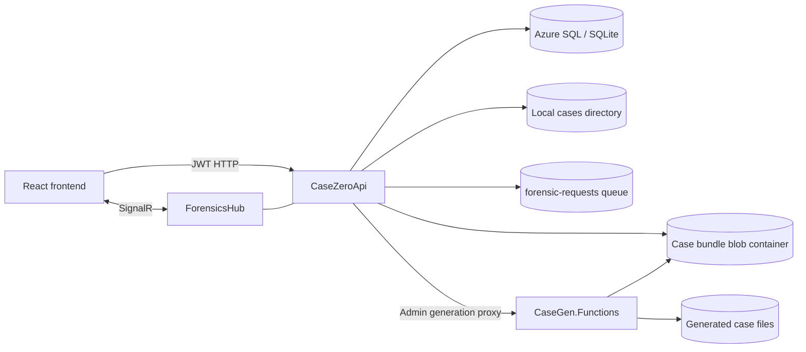
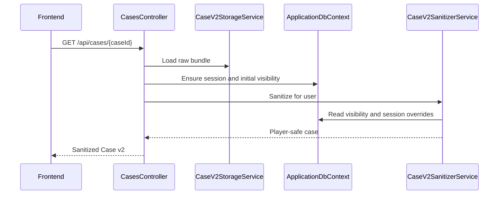
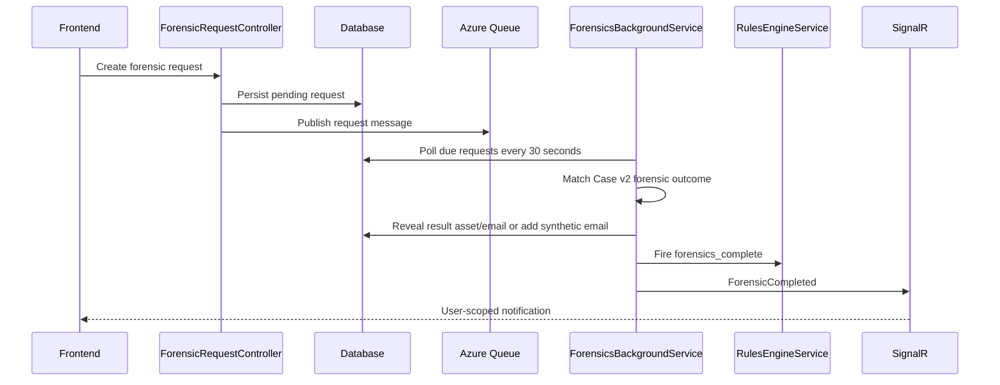

# Backend Architecture — CaseZero

This document describes the runtime architecture of `backend/CaseZeroApi`. HTTP contracts are listed in [`API_COMPLETE.md`](./API_COMPLETE.md), the case bundle contract in [`CASE_JSON_V2_SPEC.md`](./CASE_JSON_V2_SPEC.md), and generation internals in [`CASE_GENERATION_PIPELINE.md`](./CASE_GENERATION_PIPELINE.md).

## Scope and responsibilities

`CaseZeroApi` is the gameplay and account backend. It:

- authenticates players and administrators;
- reads immutable Case v2 bundles;
- projects each bundle through the current player's visibility and session state;
- persists sessions, submissions, notes, forensic requests, progression, and inbox messages;
- evaluates deterministic reveal rules;
- scores solutions and applies promotions;
- streams case assets;
- publishes forensic completion notifications through SignalR;
- proxies administrator generation requests to `CaseGen.Functions`.

The API does not author case content. `functions/CaseGen.Functions` owns Case Bible construction, graph generation, validation, rendering, and bundle publication.

## Technology

| Concern | Implementation |
|---|---|
| Runtime | .NET 8 / ASP.NET Core |
| Persistence | Entity Framework Core; Azure SQL/SQL Server in deployed environments, SQLite for local development and tests |
| Identity | ASP.NET Core Identity |
| API authentication | JWT Bearer |
| Authorization roles | `PLAYER` and `ADMIN` |
| Case storage | Local `cases/<caseId>/` directories and/or Azure Blob Storage |
| Azure authentication | `DefaultAzureCredential` when a storage account name is configured; connection string/Azurite fallback |
| Realtime | SignalR at `/hubs/forensics` |
| Queue publishing | Azure Storage Queue `forensic-requests` |
| Caching | ASP.NET Core in-memory cache for parsed case bundles |
| Rate limiting | `AspNetCoreRateLimit`, IP-based and in-memory |
| API discovery | Swagger/OpenAPI in Development |

The API project targets `net8.0`. The separate `CaseGen.Functions` and `CaseGen.Functions.Tests` projects remain on `net9.0`.

## System boundaries



### Data ownership

| Store | Owned data |
|---|---|
| Case bundle | Immutable authored content: metadata, suspects, assets, emails, timeline, rules, forensic contracts, and private solution |
| Relational database | Users, roles, gameplay sessions, visibility, email state, submissions, progression, notes, forensic requests, audit records, and global inbox messages |
| Blob/local asset files | Rendered PDFs, photos, and other dossier files referenced by the bundle |
| Queue | Notification that a forensic request was created; it is not the current source of truth for completion |

The database does not contain the canonical authored Case v2 document. The API loads `case.json`, caches it, and combines it with database state for each request.

### Deployed Azure topology

In Azure, the API and Function App use managed identities and VNet integration. The case Storage account is protected by private endpoints and private DNS; public network access is disabled. The API reads published bundles and sends forensic queue messages, while `CaseGen.Functions` publishes complete bundles and writes job progress. Exact resource provisioning and RBAC assignments live under `infrastructure/`.

## Application composition

`Program.cs` configures the application in this order:

1. Load shared configuration plus optional gitignored `appsettings.Local.json`.
2. Configure controllers with camel-case JSON and null-value omission.
3. Configure EF Core for SQL Server or SQLite.
4. Configure Identity and JWT validation.
5. Configure CORS from `Cors:AllowedOrigins`.
6. Register SignalR, rate limiting, application services, Azure credentials, the forensic hosted service, and the Function App HTTP client.
7. Build the request pipeline.
8. Initialize the database and roles, then optionally seed development users/data.

### HTTP middleware order

```text
Security response headers
→ HTTPS redirect/HSTS in Production
→ CORS
→ IP rate limiting
→ route ID validation
→ authentication
→ authorization
→ controllers / SignalR hub
```

Security headers include CSP, `X-Frame-Options`, `X-Content-Type-Options`, `Referrer-Policy`, `Permissions-Policy`, and HSTS where applicable.

## Persistence

`ApplicationDbContext` inherits from `IdentityDbContext<User>`.

### Main entities

| Entity | Responsibility |
|---|---|
| `User` | Identity account, badge, rank, aggregate career statistics, and access flags |
| `Case` | Minimal relational registry used by submissions and legacy relational associations |
| `UserCase` | User-to-case association |
| `CaseProgress` | Relational case progress data |
| `CaseSession` | Active, paused, or completed play session plus serialized dynamic state |
| `CaseSessionVisibleAsset` | Asset revealed for one user and case; despite the legacy name, records are not scoped by an explicit session ID |
| `CaseSessionVisibleEmail` | Case email revealed for one user and case; records are not scoped by an explicit session ID |
| `CaseSessionEmailState` | Per-user read/open state for a case email |
| `EmailAttachmentDownloaded` | Idempotency record for case attachment downloads |
| `CaseSubmission` | Complete solution attempt, score breakdown, grading status, and submitted payload |
| `ForensicRequest` | Requested analysis, expected completion, status, and generated result references |
| `ForensicAnalysis` | Legacy/relational forensic analysis entity |
| `Evidence` | Legacy/relational evidence entity |
| `Suspect` | Legacy/relational suspect entity |
| `Note` | Player-owned investigation note |
| `Email` | Global inbox message, including promotion notices |
| `AuditLog` | Security/gameplay audit record |
| `UserRankHistory` | One row for each rank transition |

The Case v2 bundle is represented by POCOs under `Models/CaseV2`, but those objects are not persisted as EF entities.

### Dynamic session state

`CaseSession` stores stable columns for timing/status and eight JSON-serialized fields:

| Property | Logical value |
|---|---|
| `FiredRuleIds` | Rule IDs already applied to the session |
| `RevealedSuspectIds` | Suspects currently visible |
| `EmailAttachmentOverrides` | Attachments dynamically added to case emails |
| `SuspectStatusOverrides` | Dynamic suspect status values |
| `SuspectAlibiVerified` | Per-suspect verified-state overrides |
| `Notifications` | Session notifications emitted by rules |
| `SyntheticEmails` | Generated no-findings forensic emails |
| `FiredTemporalEventIds` | Temporal events already applied |

This state is serialized because its shape follows the Case v2 rule contract rather than a fixed relational schema.

### Database initialization

- SQL Server uses EF migrations through `Database.Migrate()`.
- SQLite uses `Database.EnsureCreated()` because the SQL Server migrations are not portable.
- Testing replaces the normal `ApplicationDbContext` registration.
- Current migrations live under `Data/Migrations`; they are incremental and must not be described as one consolidated migration.

## Case storage and projection

### Bundle loading

`CaseV2StorageService` is the canonical bundle reader.

Lookup order:

1. Resolve the local cases root and try `<root>/<caseId>/case.json`.
2. If blob access is enabled, try `<bundles-container>/<caseId>/case.json`.
3. Cache a successfully parsed bundle for up to 30 minutes sliding and two hours absolute.

Case listing merges local and blob cases by case ID. Local cases win when the same ID exists in both stores.

Asset streams follow the same local-first strategy. Asset URIs are resolved relative to the case bundle, and controllers verify visibility before streaming content.

### Player-safe projection

The raw bundle contains server-only information and must never be returned directly to a player. `CaseV2SanitizerService` creates `CaseV2Sanitized` by:

- including only visible assets, emails, and suspects;
- merging dynamically revealed entity IDs;
- applying email attachment overrides;
- applying suspect status and alibi overrides;
- adding synthetic forensic emails;
- exposing only available forensic analysis types;
- removing culprit IDs, correct question options, proof requirements, private rules, forensic outcomes, and generation details.

`GET /api/cases/{caseId}/raw` bypasses this projection and is restricted to `ADMIN`.

## Gameplay state flow



On first access, `CasesController` ensures a session exists and seeds:

- assets and emails whose visibility is `initial`;
- initially visible suspects;
- all entities when `metadata.unlockMode` is `all_initial`;
- the Rookie compatibility behavior when `unlockMode` is absent and `requiredRank` is `Rookie`.

`VisibilityService` provides reusable explicit asset/email reveal checks, while `CasesController` owns the complete first-access bootstrap.

## Rules and reveals

`RulesEngineService` loads the raw bundle, matches a runtime trigger against case rules, applies actions to the latest user session, and records the rule ID. A rule can therefore affect a session only once.

Supported triggers:

- `forensics_complete`
- `attachment_download`
- `asset_viewed`
- `email_opened`
- `suspect_viewed`
- `time_elapsed`
- `multiple_conditions` with `AND` or `OR`

Supported actions:

- reveal an asset, email, or suspect;
- add an attachment to an email;
- send a session notification;
- update a suspect status;
- mark a suspect alibi as verified or unverified.

Most reveal effects are written to normalized visibility tables. Variable-shape effects are written to the JSON fields on `CaseSession`.

## Forensic workflow



The relational `ForensicRequest` is the current source of truth. `ForensicsBackgroundService` completes due requests by polling the database, not by consuming the queue.

`ForensicQueueService` also publishes creation messages to `forensic-requests`, but this repository currently contains no queue-trigger consumer for those messages. The queue is therefore an integration hook, not the completion mechanism.

When a matching Case v2 forensic outcome exists, the hosted service reveals its result asset/email. Otherwise, it can create a synthetic no-findings email from the bundle template. It then applies `forensics_complete` rules and emits `ForensicCompleted` to `user-{userId}`.

Current failure semantics require care: the request is marked `completed` before outcome projection finishes. If projection or rule application throws, the exception is logged but the completion event is still emitted. Hardening this flow so persistence and notification reflect the real outcome remains an implementation task.

## Solution scoring and career progression

`SolutionService` grades submissions entirely on the server using the private solution contract:

- selected culprit;
- required evidence IDs;
- required forensic analysis IDs;
- weighted question answers;
- partial-credit weights;
- minimum passing score;
- maximum number of graded attempts.

After graded attempts are exhausted, submissions remain allowed but are stored as ungraded. They do not alter progression. Rookie cases receive full forensic-analysis credit because the interactive forensic lab is intentionally unavailable at that level.

Every submission stores its score components, full request payload, attempt number, and grading state. The explanation is returned only when the solution passes.

`PromotionService` recalculates career statistics from graded submissions, using the best score and resolved state per case. Rank is a deterministic function of total resolved cases:

| Rank | Resolved cases required |
|---|---:|
| Rook | 0 |
| Detective | 3 |
| Detective2 | 8 |
| Sergeant | 16 |
| Lieutenant | 28 |
| Captain | 44 |
| Commander | 65 |

Promotions create rank-history rows and a localized-by-the-frontend global inbox notice.

## Authentication and authorization

- Identity stores accounts and roles in the application database.
- JWTs validate issuer, audience, signature, and lifetime with zero clock skew.
- JWT bearer metadata validation currently sets `RequireHttpsMetadata=false`; deployed traffic is still expected to use HTTPS, and production hardening should make this environment-aware.
- New registrations receive `PLAYER`.
- Generation proxy and raw case access require `ADMIN`.
- SignalR requires an authenticated JWT and joins the connection to `user-{userId}`.
- Registration is currently auto-verified because outbound verification email is disabled.

## Controllers

Controllers coordinate HTTP concerns and application services. Some controllers also own request-specific orchestration, notably first-access case/session initialization and email attachment handling.

| Controller | Responsibility |
|---|---|
| `AuthController` | Registration, login, current user, and verification compatibility endpoints |
| `CasesController` | Dashboard, case listing/loading, raw admin access, existence checks, and submissions |
| `AssetsController` | Visible asset inventory and guarded streaming |
| `EmailsController` | Visible case email state, opening, details, and attachment downloads |
| `CaseTriggersController` | Asset/suspect view triggers and game-time advancement |
| `CaseSessionController` | Session lifecycle, resume, state, history, and visibility reset helper |
| `NotesController` | User-owned case notes |
| `ForensicRequestController` | User-scoped forensic request lifecycle |
| `InboxController` | Global inbox and read state |
| `ProfileController` | Career, submission, category, and promotion statistics |
| `CaseGenerationController` | `ADMIN` proxy to the CaseGen Function App |

The exact routes and response behavior are maintained in [`API_COMPLETE.md`](./API_COMPLETE.md).

## Core services

| Service | Main responsibility |
|---|---|
| `CaseV2StorageService` | Load, cache, list, and stream Case v2 bundles/assets |
| `CaseV2SanitizerService` | Produce a player-safe projection from raw bundle plus session state |
| `VisibilityService` | Seed/check explicit asset and email visibility |
| `RulesEngineService` | Evaluate idempotent Case v2 triggers and actions |
| `SolutionService` | Grade and persist solution attempts |
| `PromotionService` | Recalculate career statistics, ranks, history, and promotion inbox messages |
| `ForensicsBackgroundService` | Complete due forensic requests and publish realtime events |
| `ForensicQueueService` | Publish forensic request messages to Azure Storage Queue |
| `CaseGeneratorStorageFactory` | Build Blob/Queue clients using managed identity or local credentials |
| `JwtService` | Generate JWTs |
| `AuditLogService` | Persist audit actions |
| `DataSeedingService` | Seed development data |

## Case generation integration

`CaseGenerationController` is an authenticated `ADMIN` proxy. It forwards:

- generation requests to `POST {FunctionBaseUrl}/api/cases/v2/generate`;
- job polling to `GET {FunctionBaseUrl}/api/cases/v2/jobs/{jobId}`.

The Function App returns immediately with a job ID and runs generation through Durable Functions. Each complete attempt is one activity, with five attempts by default under the same job ID. The API returns Function responses verbatim and does not participate in Case Bible, graph, repair, rendering, or validation stages.

Generated assets are published to the shared bundles container before `case.json`; the JSON is written last as the bundle commit marker. Configured publication failures prevent the generation job from reporting success. `CaseV2StorageService` discovers completed bundles through the normal blob listing/loading path.

## Configuration

| Key | Purpose |
|---|---|
| `ConnectionStrings:DefaultConnection` | SQL Server or SQLite connection |
| `UseSqlite` | Explicitly select SQLite |
| `JwtSettings:SecretKey` | JWT signing key |
| `JwtSettings:Issuer` / `Audience` | JWT validation |
| `Cors:AllowedOrigins` | Credentialed frontend origins |
| `CaseGenerator:FunctionBaseUrl` | Function App URL used by the generation proxy |
| `CaseGenerator:FunctionKey` | Optional `x-functions-key` value |
| `CaseGeneratorStorage:AccountName` | Enables managed-identity Blob/Queue clients |
| `CaseGeneratorStorage:ConnectionString` | Local or fallback storage credentials |
| `CaseGeneratorStorage:BundlesContainer` | Bundle container, default `bundles` |
| `CaseGenV2:UseBlobStorage` | Enable/disable blob reads |
| `CaseGenV2:LocalCasesPath` | Override the local cases root |

Managed identity is preferred in Azure. Connection strings and `UseDevelopmentStorage=true` are intended for local development.

## Rate limiting

Rate limits are configured in `Program.cs` and stored in memory:

| Endpoint pattern | Limit |
|---|---:|
| All endpoints | 60/minute |
| Authentication endpoints | 50/15 minutes |
| Login | 50/5 minutes |
| Forensic request creation | 10/hour |
| Case email opening | 100/hour |
| Asset download | 50/hour |
| Case submission | 3/24 hours |

These limits are defined directly in `Program.cs`. They are IP-based and are not distributed across application instances.

## Route ID validation

`IdValidationMiddleware` rejects malformed recognized route parameters before authentication/controller execution:

- `asset.<id>`
- `email.<id>` or generated `no-findings-<uuid>`
- `suspect.<id>`
- `attachment.<id>`
- `case_<id>` or `CASE-YYYYMMDD-<8 lowercase hex>`

Letters, numbers, `_`, `-`, and `.` are accepted where defined by the corresponding regex. Invalid IDs return `400`.

## Architectural invariants

1. Never return a raw Case v2 bundle to a player.
2. Treat `case.json` as immutable authored content and SQL as mutable per-user state.
3. Apply every reveal through visibility/session state; do not mutate the bundle.
4. Keep rule execution idempotent through `FiredRuleIds` and temporal execution through `FiredTemporalEventIds`.
5. Grade against the server-only solution, never client-provided scoring data.
6. Keep Case Bible and graph generation inside `CaseGen.Functions`.
7. Prefer managed identity for deployed storage access.
8. Keep `CaseGen.Functions` and `CaseGen.Functions.Tests` on .NET 9.
