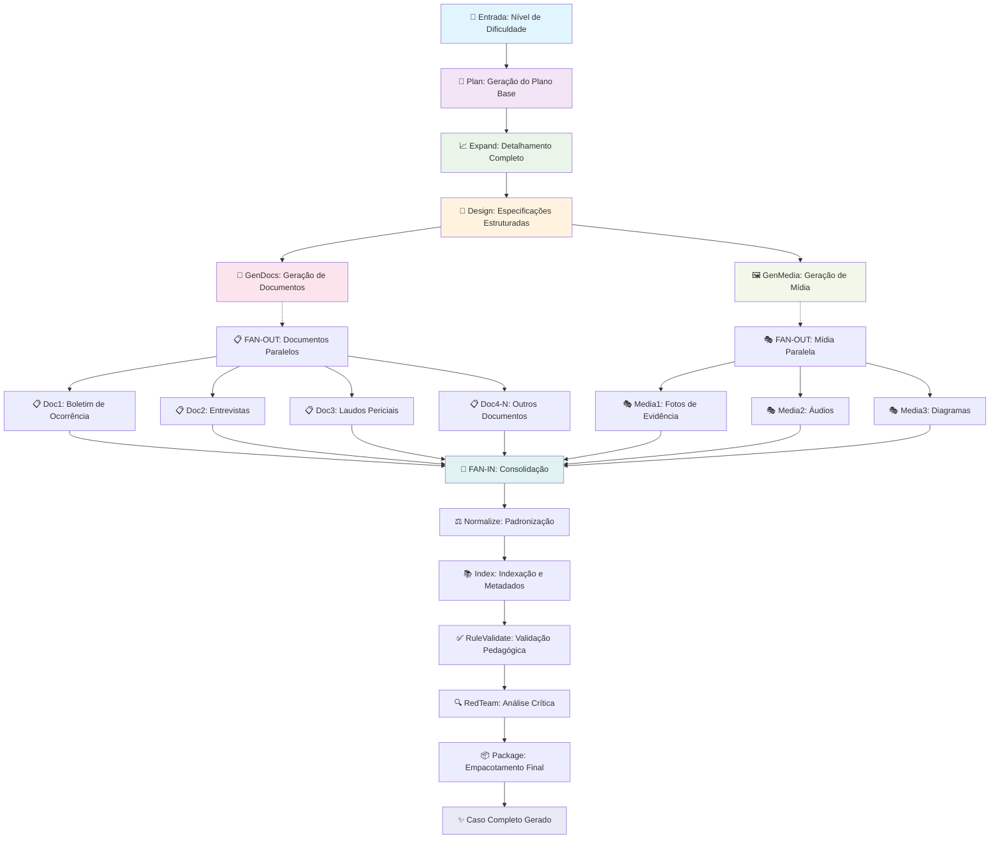

# Pipeline de Geração de Casos CaseZero

## Visão Geral

O CaseZero utiliza um **pipeline avançado de geração de casos investigativos** baseado em **Azure Durable Functions** e **AI/LLM** para criar casos educacionais completos, realistas e pedagogicamente estruturados. O sistema opera completamente de forma **automatizada**, requerendo apenas o **nível de dificuldade** como entrada.

## Arquitetura do Pipeline

### 🎯 **Entrada Simplificada**
```json
{
  "difficulty": "Rookie",           // Único parâmetro obrigatório
  "timezone": "America/Sao_Paulo", // Opcional
  "generateImages": true           // Opcional
}
```

### 🏗️ **Sistema de Dificuldade Automático**

O pipeline implementa **7 níveis de dificuldade** com perfis pré-definidos:

| Nível | Suspeitos | Documentos | Evidências | Duração | Complexidade |
|-------|-----------|------------|------------|---------|--------------|
| **Rookie** | 2-3 | 6-8 | 3-5 | 30-60min | Linear, evidências diretas |
| **Detective** | 3-4 | 8-12 | 4-7 | 45-60min | Cross-checks básicos |
| **Detective2** | 4-5 | 10-14 | 6-9 | 60-75min | Ramificações, correlações |
| **Sergeant** | 5-6 | 12-16 | 8-12 | 75-90min | Multi-fontes, forense avançada |
| **Lieutenant** | 6-8 | 14-18 | 10-15 | 90-120min | Timeline em camadas |
| **Captain** | 7-10 | 16-22 | 12-18 | 120-150min | Inferência profunda |
| **Commander** | 8-12 | 18-25 | 15-22 | 150-200min | Casos seriais, escopo global |

## Fluxograma do Pipeline



## Detalhamento das Etapas

### 🎯 **1. Plan (Planejamento)**
**Objetivo:** Gerar o plano base do caso de forma completamente automatizada

**Entrada:** Apenas o nível de dificuldade
**Processo:**
- Aplicação automática do **DifficultyProfile** correspondente
- Geração de título, local, tipo de crime e contexto realistas
- Definição de objetivos pedagógicos alinhados ao nível
- Criação da cronologia base e elementos principais

**Saída:** JSON estruturado com o plano base do caso
```json
{
  "caseId": "CASE-20250831-abc123def",
  "title": "Fraude na Startup de Fintech",
  "location": "São Paulo, SP - Vila Olímpia",
  "incidentType": "financial_fraud",
  "difficulty": "Detective2",
  "overview": "Investigação de fraude financeira...",
  "estimatedDuration": 65
}
```

### 📈 **2. Expand (Expansão)**
**Objetivo:** Detalhar completamente o caso baseado no perfil de dificuldade

**Processo:**
- **Suspeitos:** Criação de perfis detalhados com motivos e alibis
- **Evidências:** Geração de evidências físicas, digitais e testemunhais
- **Cronologia:** Timeline detalhada com eventos e correlações
- **Testemunhas:** Criação de depoimentos com variação de confiabilidade
- **Localizações:** Detalhes forenses e pontos de coleta

**Complexidade Adaptativa:**
- **Rookie/Detective:** Evidências diretas, cronologia linear
- **Sergeant/Lieutenant:** Correlações multi-fonte, análises especializadas
- **Captain/Commander:** Inferências profundas, conexões globais

### 🎨 **3. Design (Especificação)**
**Objetivo:** Transformar detalhes em especificações estruturadas para geração

**Processo:**
- Criação de **DocumentSpecs** para cada documento
- Definição de **MediaSpecs** para elementos visuais
- Configuração de **gating rules** para documentos sensíveis
- Definição de **i18nKeys** para internacionalização

**Saída:** Especificações JSON para geração paralela
```json
{
  "documentSpecs": [
    {
      "docId": "police-report-001",
      "type": "police_report",
      "sections": ["Header", "Facts", "Evidence"],
      "gated": false,
      "lengthTarget": [300, 500]
    }
  ],
  "mediaSpecs": [...]
}
```

### 📄🖼️ **4-5. GenDocs + GenMedia (Geração Paralela)**
**Padrão:** **FAN-OUT/FAN-IN** para máxima eficiência

**FAN-OUT:**
- Cada documento é gerado em **Activity paralela**
- Cada mídia é gerada em **Activity paralela**
- Execução simultânea de 10-25 atividades

**GenDocs - Tipos de Documento:**
- **police_report:** Boletins de ocorrência
- **interview:** Entrevistas com suspeitos/testemunhas
- **forensics_report:** Laudos periciais (sempre com "Cadeia de Custódia")
- **evidence_log:** Logs de evidências
- **witness_statement:** Depoimentos
- **memo_admin:** Memorandos administrativos

**GenMedia - Tipos de Mídia:**
- **photo:** Fotografias de evidências
- **audio:** Gravações de áudio
- **video:** Gravações de vídeo
- **document_scan:** Digitalizações
- **diagram:** Diagramas e esquemas

**FAN-IN:**
- Consolidação de todos os resultados
- Validação de completude

### ⚖️ **6. Normalize (Normalização)**
**Objetivo:** Padronizar e organizar todo o conteúdo

**Processo:**
- Formatação consistente de todos os documentos
- Organização lógica dos elementos
- Aplicação de metadata adequada
- Validação de estrutura

### 📚 **7. Index (Indexação)**
**Objetivo:** Criar índices e metadados para busca

**Processo:**
- Geração de **tags** e **categorias**
- Criação de **palavras-chave**
- Definição de **objetivos pedagógicos**
- Cálculo de **métricas de dificuldade**

### ✅ **8. RuleValidate (Validação Pedagógica)**
**Objetivo:** Verificar aderência às regras educacionais

**Validações:**
- Consistência narrativa
- Adequação pedagógica
- Completude das informações
- Realismo investigativo
- Aderência aos padrões de qualidade

### 🔍 **9. RedTeam (Análise Crítica)**
**Objetivo:** Análise crítica final para identificar problemas

**Processo:**
- Busca por **inconsistências lógicas**
- Identificação de **pontos fracos** na narrativa
- Sugestões de **melhorias**
- Análise de **riscos de qualidade**

### 📦 **10. Package (Empacotamento)**
**Objetivo:** Gerar o produto final para consumo

**Processo:**
- Salvamento no **Azure Blob Storage**
- Criação de **bundle metadata**
- Geração de **arquivos finais**
- Indexação para **busca e recuperação**

**Estrutura Final:**
```
cases/
├── CASE-20250831-abc123def/
│   ├── case.json           # Caso completo
│   ├── metadata.json       # Metadados e índices
│   └── documents/          # Documentos individuais
└── bundles/
    └── CASE-20250831-abc123def/
        ├── bundle.json     # Bundle completo
        └── assets/         # Recursos multimídia
```

## Vantagens do Pipeline

### 🚀 **Performance**
- **Geração Paralela:** FAN-OUT/FAN-IN reduz tempo total
- **Azure Durable Functions:** Tolerância a falhas e replay
- **Caching Inteligente:** Reutilização de componentes comuns

### 🎯 **Qualidade**
- **Validação Multi-Camadas:** 3 níveis de verificação
- **Perfis de Dificuldade:** Complexidade cientificamente calibrada
- **Red Team Analysis:** Análise crítica automatizada

### 🔧 **Manutenibilidade**
- **Arquitetura Modular:** Cada etapa é independente
- **Schema-Driven:** Toda geração é baseada em schemas JSON
- **Logs Detalhados:** Rastreabilidade completa do processo

### 🌐 **Escalabilidade**
- **Automação Completa:** Zero intervenção manual
- **Multi-Tenant:** Suporte a múltiplos usuários simultâneos
- **Resource Optimization:** Uso eficiente de recursos Azure

## Monitoramento e Logs

### 📊 **Status Tracking**
Cada execução fornece status em tempo real:
```json
{
  "caseId": "CASE-20250831-abc123def",
  "status": "Running",
  "currentStep": "GenDocs+GenMedia", 
  "progress": 0.45,
  "completedSteps": ["Plan", "Expand", "Design"],
  "estimatedCompletion": "2025-08-31T10:30:00Z"
}
```

### 📝 **Logs Detalhados**
- **Console Logs:** Status limpo e legível
- **Blob Storage:** Logs detalhados com interações LLM completas
- **Migração Automática:** Logs migram de ID temporário para ID final

### 🔍 **Troubleshooting**
- **Replay-Safe:** Durable Functions permitem replay sem efeitos colaterais
- **Error Recovery:** Retry automático em falhas temporárias
- **Detailed Diagnostics:** Stack traces e contexto completo

## Configuração e Deploy

Ver documentos específicos:
- [CASE_GENERATOR_SETUP.md](./CASE_GENERATOR_SETUP.md) - Setup inicial
- [DEPLOYMENT.md](./DEPLOYMENT.md) - Deploy em produção
- [TROUBLESHOOTING.md](./TROUBLESHOOTING.md) - Resolução de problemas

## API de Uso

### **Iniciar Geração**
```http
POST /api/StartCaseGeneration
Content-Type: application/json

{
  "difficulty": "Detective2",
  "timezone": "America/Sao_Paulo",
  "generateImages": true
}
```

### **Verificar Status**
```http
GET /api/status/{instanceId}
```

### **Recuperar Logs**
```http
GET /api/logs/{caseId}
```

---

## Conclusão

O **Pipeline de Geração de Casos CaseZero** representa uma solução robusta, escalável e educacionalmente orientada para criação automática de casos investigativos. Através da combinação de **AI/LLM**, **Azure Durable Functions**, e **design pedagógico cientificamente calibrado**, o sistema é capaz de gerar casos de alta qualidade com **zero intervenção manual**.

A arquitetura **FAN-OUT/FAN-IN** garante performance otimizada, enquanto as **múltiplas camadas de validação** asseguram qualidade educacional e consistência narrativa. O resultado é um sistema que pode gerar centenas de casos únicos, realistas e pedagogicamente efetivos para treinamento investigativo.
