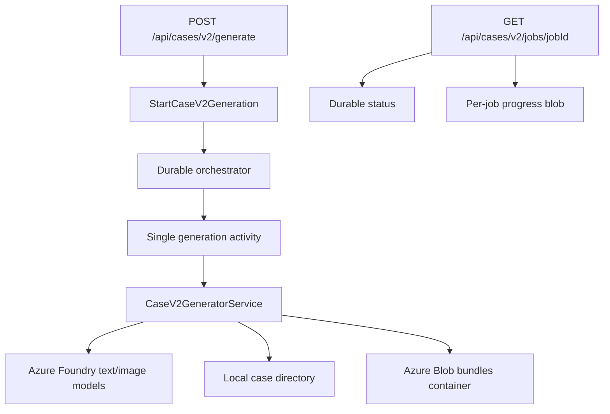

# Case Generation Pipeline

This document is the canonical architecture reference for Case v2 generation in `functions/CaseGen.Functions`.

The public case format is documented in [`CASE_JSON_V2_SPEC.md`](./CASE_JSON_V2_SPEC.md), HTTP routes in [`API_COMPLETE.md`](./API_COMPLETE.md), and gameplay consumption in [`BACKEND_ARCHITECTURE.md`](./BACKEND_ARCHITECTURE.md).

## Purpose

The generator creates a complete detective dossier from a small request:

- one selected language;
- one of seven difficulty levels;
- an optional title, theme, location, case ID, and seed;
- a persistence choice.

Generation does not translate one case into four languages. Every agent, document, rendered label, email, and player-facing field uses the language selected in the request.

The central invariant is:

> The Case Bible defines the fictional truth once. Every plot, suspect, document, observation, forensic result, rule, proof, question, and rendered asset must project from that truth.

## Runtime architecture

`CaseGen.Functions` is a .NET 9 Azure Functions isolated-worker application using Durable Functions.


```mermaid
flowchart TD
    POST[POST /api/cases/v2/generate] --> START[StartCaseV2Generation]
    START --> ORCH[Durable orchestrator]
    ORCH --> ACT[Single generation activity]
    ACT --> GEN[CaseV2GeneratorService]
    GEN --> LLM[Azure Foundry text/image models]
    GEN --> DISK[Local case directory]
    GEN --> BLOB[Azure Blob bundles container]
    STATUS[GET /api/cases/v2/jobs/jobId] --> DURABLE[Durable status]
    STATUS --> PROGRESS[Per-job progress blob]
```

The Durable orchestrator currently wraps generation in one long-running activity. Durable Functions persists orchestration state and reports terminal failures, but it cannot resume from an individual internal generation phase after an activity crash.

`JobPhaseReporter` writes best-effort progress independently of the activity result. Reporter failures never stop generation.

## Entry points

| Method | Route | Behavior |
|---|---|---|
| `POST` | `/api/cases/v2/generate` | Schedules a Durable orchestration and returns `202` with a job ID |
| `GET` | `/api/cases/v2/jobs/{jobId}` | Combines Durable runtime state with detailed stage progress and final result |

Example request:

```json
{
  "caseId": "case_harbor_423",
  "title": "Optional title hint",
  "theme": "A homicide at a harbor warehouse",
  "location": "Seattle, Washington",
  "difficulty": "Detective",
  "requiredRank": "Detective",
  "language": "en-US",
  "seed": 423,
  "writeToDisk": true
}
```

Supported difficulties:

- `Rookie`
- `Detective`
- `Detective2`
- `Sergeant`
- `Lieutenant`
- `Captain`
- `Commander`

Supported locale profiles are `en-US`, `pt-BR`, `es-ES`, and `fr-FR`.

A best-effort singleton check searches for an active Case v2 orchestration created in the previous 24 hours. If one is found, the starter returns `409` with its job ID. This check reduces accidental concurrency but is not a transactional distributed lock.

## Job progress model

The public progress model is versioned as `casegraph-v2`. It preserves complete-attempt history while retaining the current `stages` snapshot for compatibility.

| Public stage | Internal phases |
|---|---|
| `caseDesign` | `caseBible`, `plotOutline`, `suspectCards` |
| `graphConstruction` | `assetPlan` |
| `evidenceProduction` | `assetsAndTimelineAndBriefing`, `rookieInitialEvidence` |
| `forensicWorkflow` | `forensicsPlan`, `outcomesAndInitialEmails` |
| `solutionDesign` | `mechanicalRules`, `rulesAndSolutionSkeleton`, `questionsAndExplanation` |
| `deterministicValidation` | `consistency`, `autoFixSchema` |
| `solutionWitness` | `solutionWitness` |
| `advisoryReview` | `advisoryReview` |
| `targetedRepair` | `targetedRepair` |
| `finalValidation` | `finalValidation` |
| `finalization` | `renderAssets`, `publishToBlob` |

Each public stage records status, attempt count, start/completion timestamps, and duration. The status endpoint also returns the exact internal `currentPhase`.

The job-level progress payload also returns `currentAttempt`, `maxAttempts`, `nextRetryAt`, `retryReason`, and `attempts`. Every attempt contains its own stage history, timestamps, status, and terminal error. Starting a new complete attempt does not erase earlier phases.

## Canonical data layers

The generator intentionally separates four representations.

### 1. Case Bible

`CaseBible` is the private, typed source of truth. It contains:

- world, city, jurisdiction, time zone, and police agency;
- institutions, locations, addresses, and travel times;
- people, roles, relationships, employment, and work schedules;
- devices, accounts, vehicles, and stable identifiers;
- the private incident truth and culprit;
- the chronological truth timeline;
- evidence sources;
- canonical facts;
- source-bound observations;
- clues and independent proof paths;
- decoy arcs;
- forensic opportunities;
- intentional conflicts and their resolutions;
- investigation constraints and facts that repairs must preserve.

It is bounded rather than an unlimited metadata blob. Its structured-output schema limits collection sizes and enforces typed IDs so downstream prompts receive a manageable, referentially stable world model.

### 2. Case draft

`CaseDraft` is the mutable orchestration workspace. It contains the Case Bible plus projected metadata, blueprint, suspect cards, asset plans, complete asset content, emails, forensic contracts, rules, solution, questions, and validation state.

LLM tasks edit specific draft surfaces. They do not rewrite the entire final case document.

### 3. Evidence graph and CaseGraph

`EvidenceGraphCompiler` compiles the evolving evidence plan into claims and source relationships used during authoring.

`CaseGraph` is the typed logical model used for validation and deterministic play simulation. It contains:

- entities and suspect references;
- canonical facts and observations;
- evidence sources and assigned observations;
- derivations and culprit conclusions;
- player actions and reveal dependencies;
- forensic transforms;
- decoy arcs;
- required evidence and analysis IDs.

The graph is rebuilt after the solution skeleton because required evidence and analysis IDs are selected during that phase. It is also rebuilt after repairs.

### 4. Public Case v2 contract

The final player/runtime contract is `case.json`.

When `CaseGenV2:CaseGraphEnabled=true`, `CaseGraphPublicContractCompiler` compiles the public contract from the canonical graph. The generator also builds the legacy projection and compares both surfaces for parity.

When the feature flag is false, the legacy assembler remains the public output, but the internal graph is still built for proof, reachability, solver, and quality validation.

The feature flag defaults to `false`; deployments that require graph-compiled output must enable it explicitly.

## Generation phases

### 1. Case Bible

Internal phase: `caseBible`

`CaseBibleTask` asks the model for one structured canonical world using difficulty-specific requirements and the forensic method catalog.

After each response:

1. Request overrides are applied so the selected language, location, and other explicit inputs win.
2. `CaseBibleNormalizer` canonicalizes IDs, timestamps, UTC offsets, references, visibility, reciprocal device/account links, literal values, locations, and duplicate facts.
3. `CaseBibleValidator` performs semantic and referential validation.
4. On failure, the task can make up to three semantic attempts with actionable validation errors and compact-output guidance.
5. If the final normalized result remains invalid, generation stops with `CaseBibleValidationException`.

Normalization must occur before semantic validation.

### 2. Plot projection

Internal phase: `plotOutline`

`PlotOutlineTask` projects the Bible into:

- public case metadata;
- private incident blueprint;
- suspect stubs;
- clue ladder;
- red-herring design;
- locale/procedural context;
- culprit ID.

The task must reuse canonical people, locations, dates, identifiers, motives, alibis, and incident facts rather than invent replacements.

The Case Bible is validated again after projection. Projection mismatches are treated as blueprint defects, not permission to replace an otherwise valid Bible.

### 3. Suspect cards

Internal phase: `suspectCards`

One `SuspectCardTask` runs per suspect in parallel. Each card expands the canonical person into the player-facing profile while preserving:

- name, age, occupation, and relationship;
- public motive and stated alibi;
- background and dossier presentation;
- canonical photo relationship.

Private truth such as a verified culprit alibi state must not be exposed merely because it exists in the Bible.

### 4. Asset portfolio and graph construction

Internal phase: `assetPlan`

`EvidenceArchetypeCatalog` first creates a deterministic dossier portfolio from the difficulty profile, seed, suspects, clue source types, decoys, and forensic needs.

Every portfolio includes:

- an initial incident report;
- the required number of scene photographs;
- a portrait for every suspect;
- an interview for every suspect;
- specialized evidence needed by digital or forensic clues;
- contextual and corroborative filler selected from multiple evidence families.

`AssetPlanTask` adapts these fixed slots to the case without removing the contractual dossier structure. `EvidenceGraphCompiler` then compiles the first evidence graph.

### 5. Evidence production

Internal phase: `assetsAndTimelineAndBriefing`

The generator runs in parallel:

- one `AssetCardTask` per planned asset;
- deterministic `PlayerTimelineCompiler`;
- `BriefingEmailTask`.

Each asset prompt receives the exact canonical observations assigned to that asset. This prevents every interview, photograph, or report from being forced to contain every clue.

Document-like assets produce structured `EvidenceDocument` content. The selected language is propagated to each document so PDF chrome, headings, page labels, letterheads, and signatures render consistently.

The public timeline is compiled only from explicitly public Case Bible events and is checked for culprit-name leakage.

### 6. Forensic workflow

Internal phases: `forensicsPlan` and `outcomesAndInitialEmails`

Rookie cases skip the interactive forensic workflow. Their complete solution path is available through the initial dossier.

For every other difficulty:

1. `ForensicsPlanTask` selects valid asset/analysis pairs from the forensic method catalog.
2. `ForensicOutcomeTask` runs per planned analysis in parallel.
3. Result assets and result emails are created when findings exist.
4. `InitialEmailsTask` creates the initial communication set.
5. At least one valid decisive attribution result is enforced for cases that require forensic progression.

Forensic methods define accepted input object/asset types, producible properties, and limitations. A result may not claim a property the selected method cannot produce.

After this phase, the evidence graph is recompiled.

### 7. Mechanical rules

Internal phase: `mechanicalRules`

`MechanicalRulesBuilder` deterministically emits reveal rules from the forensic contracts. This avoids relying on the model to wire core reachability.

Typical behavior:

```text
forensics_complete(input asset + analysis type)
→ reveal result asset
→ reveal result email
```

### 8. Solution and narrative rules

Internal phase: `rulesAndSolutionSkeleton`

Execution is sequential:

1. `SolutionSkeletonTask` selects required evidence, required analyses, question topics, score constraints, and culprit.
2. For non-Rookie cases, `RulesTask` adds narrative reveal behavior where needed.
3. `CaseGraphProjection.RefreshGeneratedGraph` rebuilds graph requirements from the completed solution.

Refreshing the graph here is mandatory. A graph compiled only before the solution exists cannot validate the actual required evidence path.

### 9. Questions and explanation

Internal phase: `questionsAndExplanation`

Question tasks run in parallel by topic while `ExplanationTask` writes the post-solution explanation.

Questions must cite reachable evidence provenance. Correct option IDs and the explanation remain inside the server-only `solution` section; the backend sanitizer removes them from the active player view.

### 10. Deterministic consistency and assembly

Internal phase: `consistency`

`ConsistencyValidator` checks and may normalize cross-surface details before assembly.

The generator then:

1. prepares the canonical CaseGraph;
2. assembles both legacy and graph-compiled public representations;
3. selects the configured output mode;
4. validates the JSON schema;
5. validates Case Bible semantics;
6. validates blueprint, evidence plan/content, forensic, locale, and difficulty contracts;
7. validates graph/public parity when graph mode is enabled.

If errors exist, `SchemaErrorAutoFixer` applies deterministic fixes for known mechanical defects, such as common ID-format drift, and validation runs again.

### 11. Deterministic solution witness

Internal phase: `solutionWitness`

`SolverTask` is deterministic; it does not ask an LLM to guess the culprit.

It:

1. validates logical solvability;
2. simulates a player inspecting available assets;
3. performs comparisons and forensic requests as they become reachable;
4. computes derivation closure over player-visible observations;
5. identifies a valid culprit proof path;
6. accuses the culprit using exact observation citations;
7. answers generated questions;
8. grades the attempt using the same scoring model as the backend.

A case fails if the logical proof, narrative simulation, accusation citations, or final score does not pass.

### 12. Specialist advisory review

Internal phase: `advisoryReview`

Five specialist reviews run in parallel:

- document fidelity;
- scientific realism;
- narrative/human behavior;
- locale/procedural realism;
- player experience.

Each review receives a narrow surface plus the Case Bible. Deterministic validators seed the specialist reports with objective findings. LLM specialist findings are advisory medium-severity observations; deterministic high-severity findings are blocking.

The historical `RedTeamTask` name remains as an adapter around this specialist system for API compatibility.

Rookie verdict calibration may convert `needs_review` to `ok` when there are no high-severity findings and no more than the configured number of medium findings. The findings remain visible in telemetry.

### 13. Targeted repair

Internal phase: `targetedRepair`

Repair runs when any of these remain:

- deterministic validation errors;
- a failed solver;
- blocking specialist findings.

`RepairCoordinator` maps each problem to its owning node/stage and invalidates only the required downstream surfaces.

Examples:

- a true Case Bible semantic defect may regenerate the Bible and all dependent projections;
- a projection mismatch repairs the blueprint without discarding a valid Bible;
- one defective asset can be rewritten without regenerating the whole portfolio;
- forensic defects regenerate forensic outcomes and their dependent rules/solution;
- solver failure repairs evidence/solution reachability.

After each iteration:

1. affected tasks rerun;
2. the evidence graph and CaseGraph refresh;
3. assembly and deterministic validation rerun;
4. specialist review and solver rerun;
5. quality is compared with the best prior deep snapshot.

The loop:

- uses per-node repair budgets;
- freezes unaffected valid nodes;
- records granular operations and plateaus;
- stops after two non-improving iterations;
- restores the best snapshot after regression;
- restores the best snapshot if the LLM endpoint becomes temporarily unavailable;
- is capped by the difficulty profile or `CaseGenV2:RepairMaxIterations`.

The response fields named `RefineAttempted`, `RefineIterations`, and related metrics are retained for API compatibility. The active architecture performs owner-stage targeted repair, not wholesale final-JSON rewriting.

### 14. Final validation

Internal phase: `finalValidation`

`CaseV2FinalValidator` is the final persistence gate. It aggregates:

| Gate | Validates |
|---|---|
| `Schema` | Public `case.json` structure |
| `CaseBible` | Canonical semantic/reference integrity |
| `Graph` | Typed graph structure |
| `Proof` | Culprit uniqueness, independent proof paths, premature leakage |
| `Reachability` | Player can reach required observations and actions |
| `Forensic` | Method/input/output correctness and decisive attribution |
| `Evidence` | Portfolio, content, observation assignment, and visual requirements |
| `Difficulty` | Required topology for the selected level |
| `Locale` | Language, time, address, and procedural consistency |
| `Solver` | Logical and narrative simulation success with citations |
| `Specialist` | Remaining objective/advisory findings |
| `RookieRegression` | Rookie-specific no-lab and initial-access guarantees |
| `PublicParity` | Legacy/graph public contract equivalence when applicable |

Only non-blocking issues may remain when persistence begins.

### 15. Rendering and persistence

Internal phase: `renderAssets`

Persistence requires:

```text
writeToDisk = true
AND zero accumulated validation errors
AND zero blocking final-validation issues
```

`AssetRenderingService` materializes:

- `pdf`, `document`, and `digital` assets as PDFs using QuestPDF;
- `photo` and `image` assets through the configured image model.

Visual evidence is no longer optional at the portfolio level. Every difficulty requires scene photographs and one portrait per suspect. Scene and suspect-portrait rendering failures are therefore mandatory failures:

- the case is not written or published;
- the incomplete case directory is deleted;
- rendering errors are returned.

Optional object or surveillance images may fail without being classified as mandatory visual failures, but their errors remain in telemetry.

After successful rendering, generated filenames are written back into asset URIs and `case.json` is persisted.

When graph mode is enabled, the local directory also receives private diagnostics:

- `case.graph.private.json`
- `validation-report.private.json`
- `case.draft.private.json`
- `rendered-text.private.json`
- `solver-trace.private.json`

These private diagnostics are not uploaded by `CaseV2BlobPublisher`.

### 16. Blob publication

Internal phase: `publishToBlob`

When configured, `CaseV2BlobPublisher` uploads only:

- `<caseId>/case.json`
- `<caseId>/assets/*`

to the configured bundles container.

The backend's `CaseV2StorageService` reads this same layout.

Blob publication is best-effort. If upload fails, generation logs the failure and leaves the validated case on the local filesystem; `BlobsPublished` remains zero. A successful local generation is therefore not proof that the case reached production storage.

## Difficulty contracts

Difficulty changes dossier volume and reasoning topology, not just wording.

| Difficulty | Assets | Investigative | Scene photos | Suspects | Analyses | Proof paths | Decoys | Derivation depth | Forensic hops | All initial |
|---|---:|---:|---:|---:|---:|---:|---:|---:|---:|---|
| Rookie | 10–14 | 5–7 | 1–2 | 3–4 | 0 | 2 | 2 | 1–2 | 0 | Yes |
| Detective | 12–16 | 6–8 | 1–2 | 3–4 | 1–2 | 2 | 2 | 3–4 | 1 | No |
| Detective2 | 13–17 | 7–9 | 1–2 | 4–5 | 1–2 | 2 | 3 | 4–5 | 1 | No |
| Sergeant | 14–18 | 8–10 | 2–3 | 4–5 | 1–3 | 2 | 3 | 4–6 | 1 | No |
| Lieutenant | 15–19 | 8–11 | 2–3 | 4–6 | 2–3 | 3 | 3 | 5–7 | 2 | No |
| Captain | 16–20 | 9–12 | 2–3 | 5–6 | 2–4 | 3 | 4 | 5–8 | 2 | No |
| Commander | 17–22 | 10–13 | 2–4 | 5–6 | 2–4 | 3 | 4 | 6–9 | 3 | No |

Higher levels additionally require more evidence families, cross-source correlations, reliability levels, optional analyses, meaningful investigation order, conflicting observations, partially overlapping proof paths, and deeper red-herring resolution.

Proof-path independence is measured through distinct non-forensic evidentiary origins. Multiple paths cannot claim independence merely because they share the same decisive forensic result.

## Prompt architecture

All Case v2 LLM and image prompt templates live under:

```text
functions/CaseGen.Functions/agents/case-v2/
```

There are 42 Markdown files: system/user pairs for 21 prompt families.

`AgentPromptCatalog`:

- locates the prompt directory from build, working-directory, or repository layouts;
- caches templates;
- validates agent names;
- verifies that every placeholder has a supplied value;
- performs invariant-culture substitution;
- throws when a prompt file or variable is missing.

The project file copies prompts to both build and publish output. Runtime tasks reference prompt names such as `CaseBible`, `PlotOutline`, `AssetCard`, `ForensicOutcome`, `SpecialistReview`, and `ImageRenderScene`; prompt prose is not embedded in task code.

Deterministic components such as timeline compilation, mechanical rules, graph validation, and solver simulation do not require prompts.

## Output and telemetry

The compact Durable job result includes:

- case ID and local output path;
- validation error count and message;
- rendered PDF/image counts;
- blob publication count;
- stage latency;
- deterministic auto-fixes;
- repair/refine compatibility metrics;
- input/output token counts;
- graph-mode and final-validation results;
- graph validation and first-pass success flags;
- repair operations and plateau counts;
- solver status;
- evidence layout diversity;
- specialist findings by category;
- specialist/red-team verdict trajectory.

Large generated content and asset bytes are not stored in Durable orchestration state.

## Configuration

| Key | Purpose |
|---|---|
| `AzureFoundry:Endpoint` | Azure Foundry endpoint |
| `AzureFoundry:ModelName` | Structured text model deployment |
| `AzureFoundry:ImageDeploymentName` | Image model deployment |
| `AzureFoundry:ApiKey` | Model API credential |
| `CaseGenV2:CaseGraphEnabled` | Emit graph-compiled public contract; defaults to `false` |
| `CaseGenV2:CasesBasePath` | Local output root |
| `CaseGenV2:DisableBlobPublishing` | Disable publication |
| `CaseGenV2:RepairMaxIterations` | Override difficulty repair limit |
| `CaseGenV2:RookieMaxMediumFindings` | Rookie advisory verdict tolerance |
| `CaseGeneratorStorage:AccountName` | Managed-identity storage account |
| `CaseGeneratorStorage:ConnectionString` | Local/fallback storage connection |
| `CaseGeneratorStorage:BundlesContainer` | Published bundle container, default `bundles` |

Model and storage credentials must be supplied through configuration/environment, never committed.

## Local validation

Run the Case v2 test suite:

```powershell
dotnet test functions\CaseGen.Functions.Tests\CaseGen.Functions.Tests.csproj --filter "FullyQualifiedName~CaseGen.Functions.Tests.CaseV2"
```

Run real graph-mode generation without starting the Functions host:

```powershell
scripts\validate-casev2.ps1 `
  -Mode DirectGenerate `
  -Difficulty Detective `
  -Seed 423 `
  -Theme "harbor warehouse homicide" `
  -Language en-US `
  -CaseId case_bible_detective_423
```

Other harness modes:

| Mode | Purpose |
|---|---|
| `Goldens` | Validate persisted golden artifacts |
| `Artifact` | Validate one existing case directory |
| `Generate` | Generate through a running Functions host and validate the result |
| `DirectGenerate` | Invoke the real provider through the integration harness |
| `Batch` | Generate a seed/theme matrix and aggregate quality telemetry |
| `Full` | Run the complete CaseV2 test filter |

Real generation is nondeterministic and can take several minutes or longer. Unit and golden tests should be used for fast structural validation; real generation is required before release for each difficulty whose behavior changed.

Run a resumable sequential soak matrix:

```powershell
scripts\run-casev2-soak.ps1 `
  -CasesPerDifficulty 3 `
  -CooldownSeconds 60 `
  -MaxAttempts 3 `
  -Language en-US `
  -ReportPath casev2-soak-report.json
```

The soak harness uses concurrency `1`, persists progress after every attempt, skips already-passed seeds when resumed, and applies exponential backoff. Successful case directories are removed after metrics are recorded unless `-KeepCases` is supplied.

The July 24, 2026 soak test completed 20 cases and cancelled one. Fourteen passed, six failed after three attempts, and no rate limits were observed. The 70% final pass rate and 40% first-attempt pass rate are not sufficient for unattended production generation. See [`CASE_GENERATION_SOAK_TEST_2026-07-24.md`](./CASE_GENERATION_SOAK_TEST_2026-07-24.md) for the complete results, failed seeds, production-readiness assessment, and prioritized remediation plan.

## Code map

| Path | Responsibility |
|---|---|
| `Functions/CaseV2/CaseV2GenerationOrchestrator.cs` | HTTP starter/status, Durable orchestrator, activity, compact result |
| `Services/CaseV2/CaseV2GeneratorService.cs` | End-to-end phase orchestration |
| `Services/CaseV2/CaseBible.cs` | Typed canonical world model and normalizer |
| `Services/CaseV2/CaseBibleValidator.cs` | Bible semantic and reference validation |
| `Services/CaseV2/Tasks/CaseBibleTask.cs` | Canonical-world generation and retry |
| `Services/CaseV2/CaseGraph.cs` | Typed logical graph |
| `Services/CaseV2/CaseGraphProjection.cs` | Bible/draft projection and graph refresh |
| `Services/CaseV2/CaseGraphMigration.cs` | Graph feature flag, public compiler/parity, persistence gate |
| `Services/CaseV2/CaseProofEngine.cs` | Proof closure, uniqueness, independence, reachability |
| `Services/CaseV2/DifficultyProfileCatalog.cs` | Dossier and topology budgets for all levels |
| `Services/CaseV2/EvidenceArchetypeCatalog.cs` | Deterministic dossier portfolio |
| `Services/CaseV2/RepairCoordinator.cs` | Owner-stage repair and downstream regeneration |
| `Services/CaseV2/GranularRepair.cs` | Node dependency index, operations, budgets, plateaus |
| `Services/CaseV2/SpecialistReview.cs` | Deterministic and LLM specialist reviews |
| `Services/CaseV2/CaseV2FinalValidation.cs` | Final validation and private diagnostics |
| `Services/CaseV2/AssetRenderingService.cs` | PDF/image rendering |
| `Services/CaseV2/CaseV2BlobPublisher.cs` | Public bundle publication |
| `Services/CaseV2/JobPhaseReporter.cs` | Versioned progress document |
| `Services/CaseV2/AgentPromptCatalog.cs` | External Markdown prompt loading |
| `agents/case-v2/` | All Case v2 prompt templates |
| `scripts/run-casev2-soak.ps1` | Resumable sequential real-generation soak matrix |
