# 🚀 CaseZero CI/CD Documentation

## Overview

This document provides comprehensive documentation for the CaseZero Detective Investigation System's CI/CD pipeline implementation using GitHub Actions, BICEP infrastructure as code, and Azure cloud services.

## Table of Contents

1. [Pipeline Overview](#pipeline-overview)
2. [Environment Strategy](#environment-strategy)
3. [Security & Compliance](#security--compliance)
4. [Cost Optimization](#cost-optimization)
5. [Getting Started](#getting-started)
6. [Troubleshooting](#troubleshooting)

## Pipeline Overview

### 🔄 Continuous Integration (CI)

The CI pipeline (`ci.yml`) runs on every push and pull request to main/develop branches:


#### CI Jobs:
- **🔴 Backend CI**: .NET 8 build, restore, unit tests
- **🔵 Frontend CI**: Node.js build, linting, unit tests, artifacts upload  
- **🔗 Integration Tests**: End-to-end API testing with in-memory database
- **🛡️ Security Scan**: CodeQL analysis for C# and JavaScript
- **📋 Dependency Check**: NPM audit and .NET vulnerability scanning
- **📁 Case Validation**: Automated validation of investigation case structure

### 🚀 Continuous Deployment (CD)

#### DEV Environment (`cd-dev.yml`)
- **Trigger**: Push to `develop` branch
- **Approval**: Automatic deployment
- **Features**: 
  - Automated testing before deployment
  - Health checks post-deployment
  - Teams notifications

#### PROD Environment (`cd-prod.yml`)
- **Trigger**: Push to `main` branch or manual dispatch
- **Approval**: **Manual approval required** 
- **Features**:
  - Enhanced security scanning
  - Blue/green deployment with staging slots
  - Automatic rollback on health check failure
  - Release creation with changelog

```mermaid
graph TD
    A[Main Branch Push] --> B[Security Scan]
    B --> C[Build & Test]
    C --> D[🔒 Manual Approval]
    D --> E[Deploy to Staging]
    E --> F[Health Check]
    F --> G{Health OK?}
    G -->|Yes| H[Swap to Production]
    G -->|No| I[🔄 Rollback]
    H --> J[Production Health Check]
    J --> K[Create Release]
```



### 🏗️ Infrastructure Deployment (`infrastructure.yml`)

Infrastructure as Code using BICEP templates with Azure verified modules:

- **Manual Trigger**: Workflow dispatch with environment selection
- **Actions**: Deploy, Validate, or Destroy
- **Safety**: Destroy requires "CONFIRM" input
- **What-If Analysis**: Preview changes before deployment

## Environment Strategy

### 🧪 Development Environment
- **Branch**: `develop`
- **Resource Group**: `casezero-dev-rg`
- **SKU**: Basic (B1) - Cost optimized
- **Features**:
  - Auto-deployment on push
  - Shared resources
  - 30-day log retention
  - No backups

### 🏭 Production Environment  
- **Branch**: `main`
- **Resource Group**: `casezero-prod-rg`
- **SKU**: Standard (S1) - Performance optimized
- **Features**:
  - Manual approval required
  - Blue/green deployment
  - 90-day log retention
  - Automated backups
  - Zone redundancy
  - Staging slots

## Security & Compliance

### 🔐 Security Features

1. **Environment Protection Rules**
   - Production requires manual approval
   - Environment-specific secrets
   - Restricted branch policies

2. **Code Security**
   - CodeQL static analysis
   - Dependency vulnerability scanning
   - Automated security updates

3. **Infrastructure Security**
   - HTTPS enforcement
   - SQL firewall rules
   - Managed identities
   - Key Vault integration

4. **Deployment Security**
   - Staging slot validation
   - Health check gates
   - Automatic rollback
   - Audit logging

### 🛡️ Required Secrets

#### Repository Secrets
```yaml
# Azure Credentials
AZURE_CREDENTIALS_DEV       # Dev environment service principal
AZURE_CREDENTIALS_PROD      # Prod environment service principal

# Static Web Apps
AZURE_STATIC_WEB_APPS_API_TOKEN_DEV   # Dev SWA deployment token
AZURE_STATIC_WEB_APPS_API_TOKEN_PROD  # Prod SWA deployment token

# Resource Groups
AZURE_RESOURCE_GROUP_DEV    # Dev resource group name
AZURE_RESOURCE_GROUP_PROD   # Prod resource group name

# Notifications
TEAMS_WEBHOOK_URL           # Microsoft Teams notifications
```

#### Environment Secrets
```yaml
# Development Environment
development:
  - AZURE_CREDENTIALS_DEV
  - Database connection strings
  - API keys

# Production Environment  
production:
  - AZURE_CREDENTIALS_PROD
  - Database connection strings
  - API keys
  - SSL certificates
```

## Cost Optimization

### 💰 Cost-Optimized Features

1. **Environment-Based Scaling**
   ```yaml
   Dev Environment:
     - App Service Plan: B1 (Basic)
     - SQL Database: Basic (2GB)
     - Storage: Standard_LRS
     - Single instance
   
   Prod Environment:
     - App Service Plan: S1 (Standard) 
     - SQL Database: S1 (20 DTU)
     - Storage: Standard_GRS
     - Zone redundancy
   ```

2. **Resource Optimization**
   - Auto-scaling based on demand
   - Conditional backup policies
   - Environment-specific retention periods
   - Shared development resources

3. **Monitoring & Alerting**
   - Application Insights with sampling
   - Cost alerts and budgets
   - Performance monitoring
   - Usage analytics

### 📊 Estimated Monthly Costs

| Component | Development | Production |
|-----------|------------|------------|
| App Service Plan | $13.14 | $73.00 |
| SQL Database | $4.90 | $15.00 |
| Storage Account | $2.00 | $5.00 |
| Static Web App | $0.00 | $9.00 |
| Application Insights | $2.30 | $10.00 |
| **Total** | **~$22** | **~$112** |

*Prices are estimates based on East US 2 region and may vary*

### 💡 Cost Optimization Tips

1. **Development Environment**
   - Use Basic SKUs
   - Shared SQL databases
   - Auto-shutdown policies
   - Minimal retention periods

2. **Production Environment**
   - Right-size resources based on usage
   - Use reserved instances for predictable workloads
   - Implement auto-scaling
   - Regular cost reviews

3. **Monitoring**
   - Set up cost alerts
   - Use Azure Cost Management
   - Monitor resource utilization
   - Clean up unused resources

## Getting Started

### Prerequisites

1. **Azure Subscription** with appropriate permissions
2. **GitHub Repository** with Actions enabled
3. **Azure CLI** installed locally
4. **Service Principal** for each environment

### Setup Steps

#### 1. Create Azure Service Principals

```bash
# Development Environment
az ad sp create-for-rbac --name "casezero-dev-sp" \
  --role contributor \
  --scopes /subscriptions/{subscription-id}/resourceGroups/casezero-dev-rg \
  --sdk-auth

# Production Environment  
az ad sp create-for-rbac --name "casezero-prod-sp" \
  --role contributor \
  --scopes /subscriptions/{subscription-id}/resourceGroups/casezero-prod-rg \
  --sdk-auth
```

#### 2. Configure GitHub Secrets

Add the JSON output from the service principal creation to:
- `AZURE_CREDENTIALS_DEV` (repository secret)
- `AZURE_CREDENTIALS_PROD` (repository secret)

#### 3. Update Parameter Files

Edit `infrastructure/bicep/parameters.dev.json` and `parameters.prod.json`:
- Replace `{subscription-id}` with your Azure subscription ID
- Update Key Vault references if using Azure Key Vault

#### 4. Create Resource Groups

```bash
# Create resource groups
az group create --name casezero-dev-rg --location "East US 2"
az group create --name casezero-prod-rg --location "East US 2"
```

#### 5. Deploy Infrastructure

1. Go to GitHub Actions
2. Run "🏗️ Deploy Infrastructure" workflow  
3. Select environment and action
4. Monitor deployment progress

#### 6. Configure Environments

1. Go to Repository Settings > Environments
2. Create `development` and `production` environments
3. Configure protection rules for production:
   - Required reviewers
   - Deployment branches: `main` only

### First Deployment

1. **Infrastructure**: Run infrastructure workflow for both environments
2. **Development**: Push to `develop` branch triggers auto-deployment
3. **Production**: Push to `main` branch requires manual approval

## Troubleshooting

### Common Issues

#### 1. Authentication Failures
```bash
# Verify service principal permissions
az role assignment list --assignee {service-principal-id}

# Test authentication
az login --service-principal -u {client-id} -p {client-secret} --tenant {tenant-id}
```

#### 2. Deployment Failures
- Check Azure portal for resource deployment errors
- Verify parameter file values
- Ensure resource name uniqueness
- Check subscription quotas

#### 3. Health Check Failures
- Verify application startup
- Check application logs
- Confirm database connectivity
- Validate configuration settings

#### 4. Build Failures
- Check dependencies versions
- Verify test configurations
- Review error logs in GitHub Actions
- Ensure code quality standards

### Monitoring & Logging

#### Application Insights
- Performance monitoring
- Error tracking
- Custom telemetry
- User analytics

#### Azure Monitor
- Resource health
- Metrics and alerts
- Log Analytics
- Cost monitoring

#### GitHub Actions
- Workflow run history
- Artifact management
- Secret audit logs
- Performance metrics

### Support Resources

1. **Azure Documentation**: https://docs.microsoft.com/azure
2. **GitHub Actions**: https://docs.github.com/actions
3. **BICEP Templates**: https://docs.microsoft.com/azure/azure-resource-manager/bicep
4. **Application Insights**: https://docs.microsoft.com/azure/azure-monitor/app/app-insights-overview

---

## Next Steps

1. **Monitor Performance**: Set up dashboards and alerts
2. **Optimize Costs**: Review usage and adjust resources
3. **Enhance Security**: Implement additional security measures
4. **Scale Resources**: Adjust based on user load
5. **Backup Strategy**: Implement comprehensive backup and recovery

For questions or issues, please create an issue in the repository or contact the development team.