# 🚀 Documentação CI/CD CaseZero

## Visão Geral

Este documento fornece documentação abrangente para a implementação do pipeline CI/CD do Sistema de Investigação Detetivesca CaseZero usando GitHub Actions, infraestrutura como código BICEP e serviços Azure cloud.

## Índice

1. [Visão Geral do Pipeline](#visão-geral-do-pipeline)
2. [Estratégia de Ambientes](#estratégia-de-ambientes)
3. [Segurança e Conformidade](#segurança-e-conformidade)
4. [Otimização de Custos](#otimização-de-custos)
5. [Primeiros Passos](#primeiros-passos)
6. [Solução de Problemas](#solução-de-problemas)

## Visão Geral do Pipeline

### 🔄 Integração Contínua (CI)

O pipeline CI (`ci.yml`) executa em cada push e pull request para branches main/develop:

```mermaid
graph LR
    A[Code Push] --> B[Backend CI]
    A --> C[Frontend CI]
    B --> D[Testes de Integração]
    C --> D
    D --> E[Scan de Segurança]
    D --> F[Validação de Casos]
    E --> G[Verificação de Dependências]
    F --> G
```



#### Jobs CI:
- **🔴 Backend CI**: Build .NET 8, restore, testes unitários
- **🔵 Frontend CI**: Build Node.js, linting, testes unitários, upload de artifacts  
- **🔗 Testes de Integração**: Testes API end-to-end com banco de dados em memória
- **🛡️ Scan de Segurança**: Análise CodeQL para C# e JavaScript
- **📋 Verificação de Dependências**: NPM audit e scanning de vulnerabilidades .NET
- **📁 Validação de Casos**: Validação automatizada da estrutura de casos de investigação

### 🚀 Implantação Contínua (CD)

#### Ambiente DEV (`cd-dev.yml`)
- **Trigger**: Push para branch `develop`
- **Aprovação**: Implantação automática
- **Funcionalidades**: 
  - Testes automatizados antes da implantação
  - Health checks pós-implantação
  - Notificações do Teams

#### Ambiente PROD (`cd-prod.yml`)
- **Trigger**: Push para branch `main` ou dispatch manual
- **Aprovação**: **Aprovação manual obrigatória** 
- **Funcionalidades**:
  - Scanning de segurança aprimorado
  - Implantação blue/green com slots de staging
  - Rollback automático em falha de health check
  - Criação de release com changelog

```mermaid
graph TD
    A[Push Branch Main] --> B[Scan de Segurança]
    B --> C[Build & Test]
    C --> D[🔒 Aprovação Manual]
    D --> E[Deploy para Staging]
    E --> F[Health Check]
    F --> G{Health OK?}
    G -->|Sim| H[Swap para Produção]
    G -->|Não| I[🔄 Rollback]
    H --> J[Health Check Produção]
    J --> K[Criar Release]
```



### 🏗️ Implantação de Infraestrutura (`infrastructure.yml`)

Infraestrutura como Código usando templates BICEP com módulos verificados Azure:

- **Trigger Manual**: Workflow dispatch com seleção de ambiente
- **Ações**: Deploy, Validate ou Destroy
- **Segurança**: Destroy requer entrada "CONFIRM"
- **Análise What-If**: Prévia de mudanças antes da implantação

## Estratégia de Ambientes

### 🧪 Ambiente de Desenvolvimento
- **Branch**: `develop`
- **Grupo de Recursos**: `casezero-dev-rg`
- **SKU**: Basic (B1) - Otimizado para custo
- **Funcionalidades**:
  - Auto-implantação no push
  - Recursos compartilhados
  - Retenção de logs de 30 dias
  - Sem backups

### 🏭 Ambiente de Produção  
- **Branch**: `main`
- **Grupo de Recursos**: `casezero-prod-rg`
- **SKU**: Standard (S1) - Otimizado para performance
- **Funcionalidades**:
  - Aprovação manual obrigatória
  - Implantação blue/green
  - Retenção de logs de 90 dias
  - Backups automatizados
  - Redundância de zona
  - Slots de staging

## Segurança e Conformidade

### 🔐 Funcionalidades de Segurança

1. **Regras de Proteção de Ambiente**
   - Produção requer aprovação manual
   - Segredos específicos por ambiente
   - Políticas de branch restritivas

2. **Segurança de Código**
   - Análise estática CodeQL
   - Scanning de vulnerabilidades de dependências
   - Atualizações automáticas de segurança

3. **Segurança de Infraestrutura**
   - Imposição de HTTPS
   - Regras de firewall SQL
   - Identidades gerenciadas
   - Integração Key Vault

4. **Segurança de Implantação**
   - Validação de slot de staging
   - Gates de health check
   - Rollback automático
   - Logging de auditoria

### 🛡️ Segredos Obrigatórios

#### Segredos do Repositório
```yaml
# Credenciais Azure
AZURE_CREDENTIALS_DEV       # Service principal ambiente dev
AZURE_CREDENTIALS_PROD      # Service principal ambiente prod

# Static Web Apps
AZURE_STATIC_WEB_APPS_API_TOKEN_DEV   # Token implantação SWA dev
AZURE_STATIC_WEB_APPS_API_TOKEN_PROD  # Token implantação SWA prod

# Grupos de Recursos
AZURE_RESOURCE_GROUP_DEV    # Nome grupo recursos dev
AZURE_RESOURCE_GROUP_PROD   # Nome grupo recursos prod

# Notificações
TEAMS_WEBHOOK_URL           # Microsoft Teams notifications
```

#### Environment Secrets
```yaml
# Development Environment
development:
  - AZURE_CREDENTIALS_DEV
  - Database connection strings
  - API keys

# Production Environment  
production:
  - AZURE_CREDENTIALS_PROD
  - Database connection strings
  - API keys
  - SSL certificates
```

## Cost Optimization

### 💰 Cost-Optimized Features

1. **Environment-Based Scaling**
   ```yaml
   Dev Environment:
     - App Service Plan: B1 (Basic)
     - SQL Database: Basic (2GB)
     - Storage: Standard_LRS
     - Single instance
   
   Prod Environment:
     - App Service Plan: S1 (Standard) 
     - SQL Database: S1 (20 DTU)
     - Storage: Standard_GRS
     - Zone redundancy
   ```

2. **Resource Optimization**
   - Auto-scaling based on demand
   - Conditional backup policies
   - Environment-specific retention periods
   - Shared development resources

3. **Monitoring & Alerting**
   - Application Insights with sampling
   - Cost alerts and budgets
   - Performance monitoring
   - Usage analytics

### 📊 Estimated Monthly Costs

| Component | Development | Production |
|-----------|------------|------------|
| App Service Plan | $13.14 | $73.00 |
| SQL Database | $4.90 | $15.00 |
| Storage Account | $2.00 | $5.00 |
| Static Web App | $0.00 | $9.00 |
| Application Insights | $2.30 | $10.00 |
| **Total** | **~$22** | **~$112** |

*Prices are estimates based on East US 2 region and may vary*

### 💡 Cost Optimization Tips

1. **Development Environment**
   - Use Basic SKUs
   - Shared SQL databases
   - Auto-shutdown policies
   - Minimal retention periods

2. **Production Environment**
   - Right-size resources based on usage
   - Use reserved instances for predictable workloads
   - Implement auto-scaling
   - Regular cost reviews

3. **Monitoring**
   - Set up cost alerts
   - Use Azure Cost Management
   - Monitor resource utilization
   - Clean up unused resources

## Getting Started

### Prerequisites

1. **Azure Subscription** with appropriate permissions
2. **GitHub Repository** with Actions enabled
3. **Azure CLI** installed locally
4. **Service Principal** for each environment

### Setup Steps

#### 1. Create Azure Service Principals

```bash
# Development Environment
az ad sp create-for-rbac --name "casezero-dev-sp" \
  --role contributor \
  --scopes /subscriptions/{subscription-id}/resourceGroups/casezero-dev-rg \
  --sdk-auth

# Production Environment  
az ad sp create-for-rbac --name "casezero-prod-sp" \
  --role contributor \
  --scopes /subscriptions/{subscription-id}/resourceGroups/casezero-prod-rg \
  --sdk-auth
```

#### 2. Configure GitHub Secrets

Add the JSON output from the service principal creation to:
- `AZURE_CREDENTIALS_DEV` (repository secret)
- `AZURE_CREDENTIALS_PROD` (repository secret)

#### 3. Update Parameter Files

Edit `infrastructure/bicep/parameters.dev.json` and `parameters.prod.json`:
- Replace `{subscription-id}` with your Azure subscription ID
- Update Key Vault references if using Azure Key Vault

#### 4. Create Resource Groups

```bash
# Create resource groups
az group create --name casezero-dev-rg --location "East US 2"
az group create --name casezero-prod-rg --location "East US 2"
```

#### 5. Deploy Infrastructure

1. Go to GitHub Actions
2. Run "🏗️ Deploy Infrastructure" workflow  
3. Select environment and action
4. Monitor deployment progress

#### 6. Configure Environments

1. Go to Repository Settings > Environments
2. Create `development` and `production` environments
3. Configure protection rules for production:
   - Required reviewers
   - Deployment branches: `main` only

### First Deployment

1. **Infrastructure**: Run infrastructure workflow for both environments
2. **Development**: Push to `develop` branch triggers auto-deployment
3. **Production**: Push to `main` branch requires manual approval

## Troubleshooting

### Common Issues

#### 1. Authentication Failures
```bash
# Verify service principal permissions
az role assignment list --assignee {service-principal-id}

# Test authentication
az login --service-principal -u {client-id} -p {client-secret} --tenant {tenant-id}
```

#### 2. Deployment Failures
- Check Azure portal for resource deployment errors
- Verify parameter file values
- Ensure resource name uniqueness
- Check subscription quotas

#### 3. Health Check Failures
- Verify application startup
- Check application logs
- Confirm database connectivity
- Validate configuration settings

#### 4. Build Failures
- Check dependencies versions
- Verify test configurations
- Review error logs in GitHub Actions
- Ensure code quality standards

### Monitoring & Logging

#### Application Insights
- Performance monitoring
- Error tracking
- Custom telemetry
- User analytics

#### Azure Monitor
- Resource health
- Metrics and alerts
- Log Analytics
- Cost monitoring

#### GitHub Actions
- Workflow run history
- Artifact management
- Secret audit logs
- Performance metrics

### Support Resources

1. **Azure Documentation**: https://docs.microsoft.com/azure
2. **GitHub Actions**: https://docs.github.com/actions
3. **BICEP Templates**: https://docs.microsoft.com/azure/azure-resource-manager/bicep
4. **Application Insights**: https://docs.microsoft.com/azure/azure-monitor/app/app-insights-overview

---

## Next Steps

1. **Monitor Performance**: Set up dashboards and alerts
2. **Optimize Costs**: Review usage and adjust resources
3. **Enhance Security**: Implement additional security measures
4. **Scale Resources**: Adjust based on user load
5. **Backup Strategy**: Implement comprehensive backup and recovery

For questions or issues, please create an issue in the repository or contact the development team.