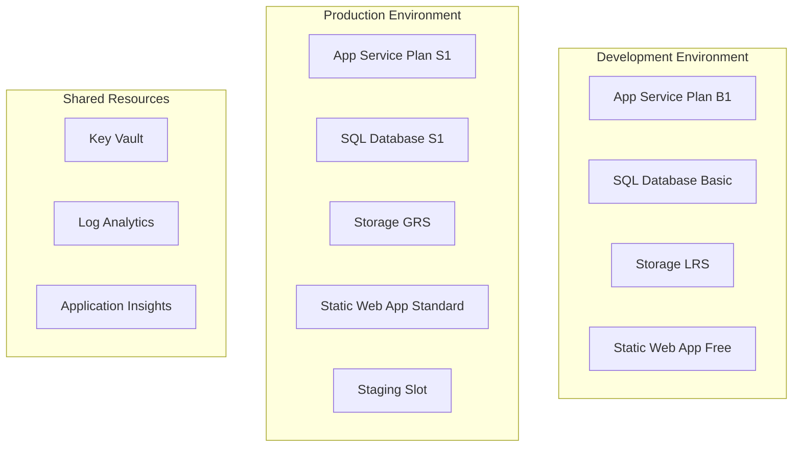

# 🏗️ Azure Resource Setup Guide

This guide provides step-by-step instructions for setting up Azure resources for the CaseZero application with cost optimization in mind.

## Prerequisites

- Azure subscription with appropriate permissions
- Azure CLI installed and configured
- PowerShell or Bash terminal
- GitHub repository with Actions enabled

## Cost-Optimized Architecture



## Step 1: Azure Subscription Setup

### 1.1 Verify Subscription Limits

```bash
# Check resource provider registrations
az provider list --query "[?registrationState=='Registered'].namespace" -o table

# Register required providers if needed
az provider register --namespace Microsoft.Web
az provider register --namespace Microsoft.Sql
az provider register --namespace Microsoft.Storage
az provider register --namespace Microsoft.Insights
```

### 1.2 Set Up Resource Groups

```bash
# Variables
SUBSCRIPTION_ID="your-subscription-id"
LOCATION="East US 2"  # Choose based on your location for cost optimization

# Set default subscription
az account set --subscription $SUBSCRIPTION_ID

# Create resource groups
az group create --name casezero-dev-rg --location "$LOCATION" --tags Environment=development Project=CaseZero
az group create --name casezero-prod-rg --location "$LOCATION" --tags Environment=production Project=CaseZero
az group create --name casezero-shared-rg --location "$LOCATION" --tags Environment=shared Project=CaseZero
```

## Step 2: Create Service Principals

### 2.1 Development Environment Service Principal

```bash
# Create service principal for development
az ad sp create-for-rbac --name "casezero-dev-sp" \
  --role "Contributor" \
  --scopes "/subscriptions/$SUBSCRIPTION_ID/resourceGroups/casezero-dev-rg" \
  --sdk-auth > dev-credentials.json

# Grant additional permissions for Static Web Apps
DEV_SP_ID=$(az ad sp list --display-name "casezero-dev-sp" --query "[0].appId" -o tsv)
az role assignment create --assignee $DEV_SP_ID \
  --role "Website Contributor" \
  --scope "/subscriptions/$SUBSCRIPTION_ID"
```

### 2.2 Production Environment Service Principal

```bash
# Create service principal for production
az ad sp create-for-rbac --name "casezero-prod-sp" \
  --role "Contributor" \
  --scopes "/subscriptions/$SUBSCRIPTION_ID/resourceGroups/casezero-prod-rg" \
  --sdk-auth > prod-credentials.json

# Grant additional permissions
PROD_SP_ID=$(az ad sp list --display-name "casezero-prod-sp" --query "[0].appId" -o tsv)
az role assignment create --assignee $PROD_SP_ID \
  --role "Website Contributor" \
  --scope "/subscriptions/$SUBSCRIPTION_ID"
```

## Step 3: Set Up Azure Key Vault (Optional but Recommended)

### 3.1 Create Key Vault

```bash
# Create Key Vault for secrets management
KEYVAULT_NAME="casezero-kv-$(date +%s)"  # Unique name

az keyvault create \
  --name $KEYVAULT_NAME \
  --resource-group casezero-shared-rg \
  --location "$LOCATION" \
  --sku standard \
  --enable-soft-delete true \
  --retention-days 7
```

### 3.2 Add Secrets to Key Vault

```bash
# Generate strong passwords
SQL_ADMIN_PASSWORD=$(openssl rand -base64 32)
JWT_SECRET=$(openssl rand -base64 64)

# Store secrets in Key Vault
az keyvault secret set --vault-name $KEYVAULT_NAME --name "sql-admin-login" --value "casezero-admin"
az keyvault secret set --vault-name $KEYVAULT_NAME --name "sql-admin-password" --value "$SQL_ADMIN_PASSWORD"
az keyvault secret set --vault-name $KEYVAULT_NAME --name "jwt-secret" --value "$JWT_SECRET"

# Grant access to service principals
az keyvault set-policy --name $KEYVAULT_NAME --spn $DEV_SP_ID --secret-permissions get list
az keyvault set-policy --name $KEYVAULT_NAME --spn $PROD_SP_ID --secret-permissions get list
```

## Step 4: Configure GitHub Repository

### 4.1 Add Repository Secrets

Navigate to your GitHub repository settings and add these secrets:

```yaml
# Azure Credentials (content from the JSON files created above)
AZURE_CREDENTIALS_DEV: |
  {
    "clientId": "...",
    "clientSecret": "...",
    "subscriptionId": "...",
    "tenantId": "...",
    "activeDirectoryEndpointUrl": "...",
    "resourceManagerEndpointUrl": "...",
    "activeDirectoryGraphResourceId": "...",
    "sqlManagementEndpointUrl": "...",
    "galleryEndpointUrl": "...",
    "managementEndpointUrl": "..."
  }

AZURE_CREDENTIALS_PROD: |
  {
    "clientId": "...",
    "clientSecret": "...",
    "subscriptionId": "...",
    "tenantId": "...",
    "activeDirectoryEndpointUrl": "...",
    "resourceManagerEndpointUrl": "...",
    "activeDirectoryGraphResourceId": "...",
    "sqlManagementEndpointUrl": "...",
    "galleryEndpointUrl": "...",
    "managementEndpointUrl": "..."
  }

# Resource Groups
AZURE_RESOURCE_GROUP_DEV: casezero-dev-rg
AZURE_RESOURCE_GROUP_PROD: casezero-prod-rg

# Teams Webhook (optional)
TEAMS_WEBHOOK_URL: https://your-organization.webhook.office.com/...
```

### 4.2 Update Parameter Files

Edit `infrastructure/bicep/parameters.dev.json`:

```json
{
  "$schema": "https://schema.management.azure.com/schemas/2019-04-01/deploymentParameters.json#",
  "contentVersion": "1.0.0.0",
  "parameters": {
    "environment": {
      "value": "dev"
    },
    "namePrefix": {
      "value": "casezero"
    },
    "location": {
      "value": "East US 2"
    },
    "appServicePlanSku": {
      "value": "B1"
    },
    "enableApplicationInsights": {
      "value": true
    },
    "enableBackup": {
      "value": false
    },
    "sqlServerAdminLogin": {
      "reference": {
        "keyVault": {
          "id": "/subscriptions/YOUR_SUBSCRIPTION_ID/resourceGroups/casezero-shared-rg/providers/Microsoft.KeyVault/vaults/YOUR_KEYVAULT_NAME"
        },
        "secretName": "sql-admin-login"
      }
    },
    "sqlServerAdminPassword": {
      "reference": {
        "keyVault": {
          "id": "/subscriptions/YOUR_SUBSCRIPTION_ID/resourceGroups/casezero-shared-rg/providers/Microsoft.KeyVault/vaults/YOUR_KEYVAULT_NAME"
        },
        "secretName": "sql-admin-password"
      }
    }
  }
}
```

Repeat for `parameters.prod.json` with production values.

## Step 5: Deploy Initial Infrastructure

### 5.1 Manual Deployment (First Time)

```bash
# Deploy development environment
az deployment group create \
  --resource-group casezero-dev-rg \
  --template-file infrastructure/bicep/main.bicep \
  --parameters @infrastructure/bicep/parameters.dev.json \
  --name initial-dev-deployment

# Deploy production environment
az deployment group create \
  --resource-group casezero-prod-rg \
  --template-file infrastructure/bicep/main.bicep \
  --parameters @infrastructure/bicep/parameters.prod.json \
  --name initial-prod-deployment
```

### 5.2 GitHub Actions Deployment

1. Go to GitHub Actions in your repository
2. Run "🏗️ Deploy Infrastructure" workflow
3. Select environment and action
4. Monitor deployment progress

## Step 6: Configure Environments

### 6.1 GitHub Environment Protection

1. Go to Repository Settings > Environments
2. Create `development` environment:
   - No protection rules needed
   - Add environment-specific secrets

3. Create `production` environment:
   - Add required reviewers
   - Restrict deployment branches to `main`
   - Add environment-specific secrets

### 6.2 Static Web Apps Configuration

After infrastructure deployment, configure Static Web Apps:

```bash
# Get Static Web App deployment tokens
DEV_SWA_TOKEN=$(az staticwebapp secrets list --name casezero-frontend-dev --query "properties.apiKey" -o tsv)
PROD_SWA_TOKEN=$(az staticwebapp secrets list --name casezero-frontend-prod --query "properties.apiKey" -o tsv)

# Add to GitHub secrets
echo "Add these to GitHub repository secrets:"
echo "AZURE_STATIC_WEB_APPS_API_TOKEN_DEV: $DEV_SWA_TOKEN"
echo "AZURE_STATIC_WEB_APPS_API_TOKEN_PROD: $PROD_SWA_TOKEN"
```

## Step 7: Cost Optimization Setup

### 7.1 Cost Alerts

```bash
# Create budget for development
az consumption budget create \
  --budget-name casezero-dev-budget \
  --amount 50 \
  --category Cost \
  --time-grain Monthly \
  --start-date 2024-01-01 \
  --end-date 2025-12-31 \
  --resource-group casezero-dev-rg

# Create budget for production
az consumption budget create \
  --budget-name casezero-prod-budget \
  --amount 200 \
  --category Cost \
  --time-grain Monthly \
  --start-date 2024-01-01 \
  --end-date 2025-12-31 \
  --resource-group casezero-prod-rg
```

### 7.2 Auto-Shutdown Policies (Development)

```bash
# Create auto-shutdown policy for dev resources
az resource create \
  --resource-group casezero-dev-rg \
  --resource-type "Microsoft.DevTestLab/schedules" \
  --name "shutdown-computevm-casezero-api-dev" \
  --properties '{
    "status": "Enabled",
    "taskType": "ComputeVmShutdownTask",
    "dailyRecurrence": {"time": "1900"},
    "timeZoneId": "UTC",
    "targetResourceId": "/subscriptions/'$SUBSCRIPTION_ID'/resourceGroups/casezero-dev-rg/providers/Microsoft.Web/sites/casezero-api-dev"
  }'
```

## Step 8: Monitoring Setup

### 8.1 Application Insights Configuration

```bash
# Get Application Insights instrumentation key
DEV_INSIGHTS_KEY=$(az monitor app-insights component show \
  --app casezero-insights-dev \
  --resource-group casezero-dev-rg \
  --query "instrumentationKey" -o tsv)

PROD_INSIGHTS_KEY=$(az monitor app-insights component show \
  --app casezero-insights-prod \
  --resource-group casezero-prod-rg \
  --query "instrumentationKey" -o tsv)

echo "Application Insights Keys:"
echo "Dev: $DEV_INSIGHTS_KEY"
echo "Prod: $PROD_INSIGHTS_KEY"
```

### 8.2 Log Analytics Workspace

```bash
# Configure log retention (cost optimization)
az monitor log-analytics workspace update \
  --resource-group casezero-dev-rg \
  --workspace-name casezero-logs-dev \
  --retention-time 30

az monitor log-analytics workspace update \
  --resource-group casezero-prod-rg \
  --workspace-name casezero-logs-prod \
  --retention-time 90
```

## Step 9: Security Hardening

### 9.1 Network Security

```bash
# Configure IP restrictions for production App Service
az webapp config access-restriction add \
  --resource-group casezero-prod-rg \
  --name casezero-api-prod \
  --rule-name "AllowCloudflare" \
  --action Allow \
  --ip-address 173.245.48.0/20 \
  --priority 100
```

### 9.2 SSL Certificates

```bash
# Enable HTTPS only
az webapp update \
  --resource-group casezero-prod-rg \
  --name casezero-api-prod \
  --https-only true

# Configure minimum TLS version
az webapp config set \
  --resource-group casezero-prod-rg \
  --name casezero-api-prod \
  --min-tls-version 1.2
```

## Step 10: Backup Configuration

### 10.1 Database Backup (Production)

```bash
# Enable long-term retention for SQL Database
az sql db ltr-policy set \
  --resource-group casezero-prod-rg \
  --server casezero-sql-prod \
  --database casezero-db \
  --weekly-retention P4W \
  --monthly-retention P12M \
  --yearly-retention P7Y \
  --week-of-year 1
```

### 10.2 Application Backup (Production)

```bash
# Configure app service backup
az webapp config backup create \
  --resource-group casezero-prod-rg \
  --webapp-name casezero-api-prod \
  --backup-name automated-backup \
  --storage-account-url "https://casezero-storage-prod.blob.core.windows.net/backups" \
  --frequency 1 \
  --frequency-unit Day \
  --retain-one true \
  --retention 30
```

## Validation Checklist

After completing the setup, verify:

- [ ] All resource groups created
- [ ] Service principals configured with appropriate permissions
- [ ] GitHub secrets added correctly
- [ ] Infrastructure deployments successful
- [ ] Applications accessible via HTTPS
- [ ] Monitoring and logging working
- [ ] Cost alerts configured
- [ ] Security settings applied
- [ ] Backup policies enabled (production)

## Cost Monitoring

Monitor your costs regularly:

1. **Azure Cost Management**: Set up dashboards and alerts
2. **Resource Tagging**: Ensure all resources are properly tagged
3. **Usage Reviews**: Monthly review of resource utilization
4. **Right-sizing**: Adjust resources based on actual usage

## Troubleshooting

### Common Issues

1. **Permission Denied**: Verify service principal roles and scopes
2. **Resource Name Conflicts**: Ensure globally unique names
3. **Quota Limits**: Check subscription limits for resources
4. **Network Connectivity**: Verify firewall rules and NSGs

### Support Resources

- Azure Support Plans: https://azure.microsoft.com/support/plans/
- Azure Documentation: https://docs.microsoft.com/azure/
- Community Forums: https://docs.microsoft.com/answers/

---

**Next Steps**: After completing this setup, proceed to deploy your applications using the GitHub Actions workflows described in the main CI/CD documentation.